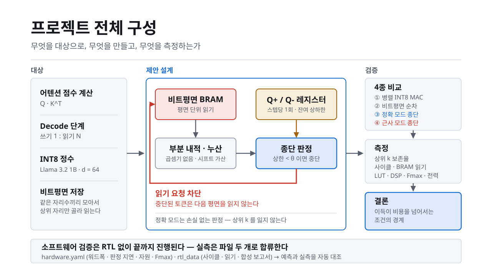

# LLM 어텐션 가속기 — MSB-first 조기 종단 (FPGA RTL 프로젝트)

[](https://github.com/hwy-10/llm-et-attention/actions/workflows/tests.yml)
[](LICENSE)
[](pyproject.toml)

**최종 산출물은 FPGA 에 올릴 RTL 이다.**  
상위 비트 우선(MSB-first) 비트평면 계산 + 조기 종단(early termination)을 하드웨어로 구현하고, **이 기법이 실제로 이득이 되는
조건의 경계**를 RTL 실측까지 포함해 정량화한다.



이 저장소의 파이썬 스택은 결과물이 아니라 **RTL의 골든 레퍼런스**다.

* **정답 기준** — 사이클 단위로 동작이 확정된 알고리즘 모델. RTL 출력이 맞는지 판정한다.
* **설계 공간 탐색** — 워드폭·분할점 m0·margin·θ 정책을 RTL 을 짓기 *전에* 확정한다.
  잘못 고르면 Verilog 를 다시 쓰는 비용이 든다.
* **실측 대조** — Vivado 시뮬레이션·합성 결과를 받아 예측과 어긋나면 잡아낸다
  (`--crosscheck`). 어긋나면 소프트웨어 모델이 틀린 것이다.

즉 검증 범위는 알고리즘에서 끝나지 않고 **RTL 실측 대조까지** 이어진다.

일반적인 디지털 회로 설계 과정에서는 RTL 구현에 앞서 1단계로 알고리즘 수준의 검증을 수행한다. 
이 단계에서는 하드웨어로 구현하려는 연산과 데이터 흐름이 의도한 대로 동작하는지 확인하고, 주요 파라미터와 입출력 조건을 검증하여 이후 구현의 기준을 정립한다. 
검증된 알고리즘과 기준 데이터는 이후 RTL 설계 및 시뮬레이션, 논리 합성, 구현 결과 측정 및 분석 단계로 이어진다.

이 저장소는 이러한 전체 설계 흐름 중 알고리즘 수준 검증과 RTL 구현에 필요한 기준 데이터 생성을 담당하며, config/hardware.yaml과 rtl_data/를 통해 이후 RTL 설계·검증 과정과 연결된다.

---

## 어디부터 읽을 것인가

목적에 따라 진입점이 다르다. 순서대로 읽으면 앞 문서가 뒤 문서의 전제가 된다.

| 목적 | 읽을 것 |
|---|---|
| **처음이라 배경이 없다면** | **[docs/](docs/)** — 배경지식 진입점. 영역별로 무엇을 어떤 순서로 볼지 |
| **손으로 따라가 보려면** | [docs/background/attention_walkthrough.md](docs/background/attention_walkthrough.md) — 4토큰 수치 예제로 종단까지 |
| **대상 모델이 궁금하다면** | [docs/background/llama_3_2_1b.md](docs/background/llama_3_2_1b.md) — 스펙·성능·KV 캐시 크기 |
| **설계를 이해하려면** | [architecture.md](architecture.md) §2~3 — **★ §2 양자화 규약이 나머지 전부의 전제다** |
| **왜 이걸 하는지** | [related_work.md](related_work.md) §0 — PADE 가 이미 존재한다는 사실부터 |
| **RTL 을 짜려면** | [config/hardware.yaml](config/hardware.yaml) + [rtl_data/schema.md](rtl_data/schema.md) |
| **코드를 만지려면** | [STRUCTURE.md](STRUCTURE.md) → `python tests/run_tests.py` 부터 |
| **발표 자료가 필요하면** | [slides/](slides/) — 16:9 슬라이드 6장 + 문서용 그림 |

> ⚠ **아래 §"합성 데이터 기준 예시 결과"의 수치는 전부 합성 Q/K 기준이다.**
> 경향을 보는 용도이고, 논문·발표에 쓸 값은 실제 텐서 캡처로 다시 뽑아야 한다.

---

## 빠른 시작

의존성은 **numpy 하나**다. 나머지는 전부 선택.

```bash
pip install numpy                      # 필수
pip install matplotlib                 # 그림 (없으면 CSV 만 나옴)
pip install PyYAML pandas pytest       # 선택 (없어도 내장 대체 구현이 동작)
```

```bash
python tests/run_tests.py              # 55개 테스트 — 먼저 이걸 통과시킬 것
python run_paper_experiments.py        # 전체 실험 + 그림 + 표  (약 1분)
```

```
outputs/raw/      실험 원본 레코드 (CSV) + 재현성 메타 (JSON)
outputs/figures/  논문용 벡터 그림 (PDF + PNG)
outputs/tables/   LaTeX / CSV 표
```

### 자주 쓰는 실행

```bash
python run_paper_experiments.py --only exp1          # 종단이 일어나는지 먼저 확인
python run_paper_experiments.py --only exp2 exp4     # 일부만
python run_paper_experiments.py --figures-only       # 실험 없이 그림만 재생성
python run_paper_experiments.py --crosscheck         # RTL 실측과 대조
python run_paper_experiments.py --generate-mock      # mock 실측 CSV 재생성
python run_paper_experiments.py --quick              # 짧은 시퀀스로 빠르게 점검

python -m experiments.exp2_margin_sweep              # 실험 단독 실행
```

---

## 실험 여섯 개

| 실험 | 답하는 질문 | 가이드 |
|---|---|---|
| **exp1** 종단 프로파일 | 평균적으로 몇 번째 평면에서 종단되는가? | 8.3 1단계 |
| **exp2** margin 스윕 | 여유값 대비 절감량과 정확도 손실 — **최종 산출물** | 8.4 / 그림 8.1 |
| **exp3** θ 정책 | θ 를 언제 확정할 것인가 | 6.3-(3) |
| **exp4** 스케줄 정책 | 종단 불규칙성 처리 + **BRAM 워드폭 함정** | 6.3-(2), 5.7 |
| **exp5** N × k 스캔 | 문맥 길이와 상위 k 에 따라 결론이 어떻게 바뀌는가 | 6.3-(4) |
| **exp6** 손익분기 | 자원·Fmax 저하를 감안하고도 이득이 남는가 | 6.3-(4), 7.3 |

**exp1 을 가장 먼저 돌린다.** 종단이 거의 일어나지 않으면 이후 RTL 구현이
전부 무의미하므로, 그 시점에 설계를 재검토해야 한다.
exp1 은 정확 모드의 무손실성도 함께 자동 점검한다.

---

## 합성 데이터 기준 예시 결과

`seq_len=512`, `head_dim=64`, `word_tokens=32`, `decision_latency=1`, 정확 모드 기준.
**아래는 합성 Q/K 기준이며 경향 확인용이다. 논문 수치는 실제 캡처로 다시 뽑아야 한다.**

### 평면별 생존 곡선 — 종단은 평면 4부터 시작된다

```
평면(MSB→LSB)   0     1     2     3     4     5     6     7
생존 비율      100%  100%  100%  100%   95%   56%   18%    7%
```

→ 2단계 처리(6.3-(2))의 분할점 m0 = 4 가 자연스러운 선택이 된다.

### 그림 8.1 — 여유값 대비 절감량 / 정확도 (top-8)

| margin | 읽기 절감 (실현) | 읽기 절감 (이론) | top-8 보존율 |
|---|---|---|---|
| 0.00 (정확 모드) | 26.6% | 27.9% | **1.0000** |
| 0.70 | 45.6% | 48.5% | **1.0000** |
| 0.80 | 53.4% | 56.9% | 0.9997 |
| 0.90 | 63.2% | 67.8% | 0.9503 |
| 1.00 | 66.6% | 71.5% | 0.4339 ← 붕괴 |

### ★ BRAM 워드폭 함정 — 이론과 실현의 격차

이론 절감 27.9% 가 워드폭과 스케줄 정책에 따라 이렇게 갈린다.

| 워드폭 | `batch` | `compaction` |
|---|---|---|
| 1 | 27.9% (100%) | 27.9% (100%) |
| 8 | 12.3% (44%) | 27.6% (99%) |
| 32 | **3.8% (14%)** | **26.6% (95%)** |
| 64 | 1.5% (5%) | 24.4% (87%) |

→ **work-compaction 없이는 메모리 읽기 절감이 실현되지 않는다.**

### 정직하게 짚어야 할 것

* 비트평면 순차 처리는 8사이클을 쓰므로 **기준 설계(①)보다 사이클이 8배 많다.**
  (512 토큰 기준 4,305 → 34,440 사이클)
* 제안의 근거는 사이클이 아니라 **(a) DSP 미사용 (b) 메모리 읽기 감소** 다.
* 추정 Fmax 기준 exp6 의 실효 speedup 은 ② 대비 0.93 으로 손익분기 미달이다.
  Vivado 실측으로 교체하기 전까지 이 결론은 잠정적이다.
* 문맥이 길수록 유리하다: 사이클 절감이 N=128 에서 −41%, N=512 에서 +10%.

---

## 실제 모델 텐서 사용하기

기본값은 합성 Q/K 다. 실제 Llama 3.2 1B 텐서를 쓰려면:

```bash
pip install "torch>=2.0" "transformers>=4.40"
python -m src.model_hooks --seq-len 512 --layer 8 --head 0
```

`cache/tensors/` 에 덤프되고, 이후 모든 실험이 **자동으로** 이걸 우선 사용한다.

> 한 번 덤프해 두는 것이 필수다. exp2 만 해도 33회 디코드 루프인데,
> 매번 모델을 forward 하면 스윕이 불가능하다.

---

## RTL 팀과의 연결

```
① RTL 팀이 rtl_data/schema.md 형식으로 결과를 놓는다
     rtl_simulation_cycles.csv     (design, seq_len, top_k, margin, cycles, bram_reads)
     <design>_synth.rpt  또는  <design>.json

② config/hardware.yaml 의 resources.* 를 실측으로 갱신하고
   source 를 estimate → vivado_synth 로 바꾼다

③ python run_paper_experiments.py --crosscheck
     예측과 실측이 5% 안에 들어오는지 확인한다  (--tolerance 로 조정)
     어긋나면 소프트웨어 모델이 틀린 것 — 원인 후보를 함께 출력한다
```

실측이 없어도 `rtl_data/mock/` 으로 이 경로 전체가 동작한다.
mock 은 소프트웨어 모델에서 생성한 것이라 항상 통과하며, 배관 점검용이다.
설정을 바꾼 뒤에는 `--generate-mock` 으로 다시 만든다.

> ⚠ `bram_reads` 는 **BRAM 워드 수**이지 토큰 수가 아니다.
> 단위가 어긋나면 대조가 통째로 무의미해진다. `rtl_data/schema.md` 참조.

---

## 설정 바꾸기

코드를 건드리지 않고 `config/` 만 고친다.

| 파일 | 내용 |
|---|---|
| `model.yaml` | 모델 스펙, 디코드 루프 길이(`seq_len`, `warmup_tokens`), 합성 데이터 |
| `quant.yaml` | ★ 양자화 규약 — 상한식 성립의 전제이므로 함부로 바꾸지 말 것 |
| `hardware.yaml` | ★ RTL 팀 인터페이스 — 워드폭, 판정 지연, 자원, Fmax |
| `sweeps.yaml` | exp1~exp6 의 스윕 범위 |

`source: estimate` 인 항목은 실행 시마다 경고로 표시된다.
전부 실측으로 교체되어 경고가 사라지면 논문에 쓸 준비가 된 것이다.

---

## 테스트

```bash
python tests/run_tests.py            # pytest 없이도 동작
python tests/run_tests.py bounds     # 일부만
pytest -q                            # pytest 가 있으면 이쪽도 가능
```

핵심 테스트:

| 파일 | 검증 |
|---|---|
| `test_bounds.py` | ★ `L_m ≤ s ≤ S_m + R_m` 이 모든 평면·모든 토큰에서 성립 |
| `test_designs.py` | ★ ①=②=③ 비트 단위 일치, 정확 모드가 top-k 를 잃지 않음 |
| `test_memory.py` | ★ 워드폭이 넓으면 흩어진 절감이 실현되지 않음 |
| `test_quantize.py` | K 자리값이 전부 양수(상한식 전제), zero-point 보정 항등식 |
| `test_decode_loop.py` | 루프 전체에서 무손실성 유지, `prev_step` 은 손실 발생 |
| `test_schedule.py` | 스케줄은 회계만 바꾸고 점수는 불변 |

---

## 블록별 검증 분담

[architecture.md §3](architecture.md) 의 블록도(조감도 2열)와 코드의 대응이다.
**블록 경계가 모듈 경계와 거의 일치하므로, 블록대로 나누면 검증 범위가 겹치지 않는다.**

| 블록도 | 코드 | 핵심 함수 |
|---|---|---|
| **비트평면 BRAM** | [src/memory.py](src/memory.py) · [src/schedule.py](src/schedule.py) · [src/quantize.py](src/quantize.py) | `word_reads_scattered()` `account_step()` `apply()` `to_bitplanes()` |
| **부분 내적 · 누산** | [src/masked_sum.py](src/masked_sum.py) · [src/accumulator.py](src/accumulator.py) | `partial_dots()` `AdderTreeModel` `accumulate()` `fold_and_quantize_query()` |
| **Q+ / Q− 레지스터** | [src/bounds.py](src/bounds.py) | `StepBounds` `.r(m)` `.l_offset(m)` `verify_bracket()` |
| **종단 판정** | [src/terminator.py](src/terminator.py) · [src/threshold.py](src/threshold.py) | `run_step()` `ThetaPolicy` `ThetaTracker` |
| **★ 읽기 요청 차단** (붉은 화살표) | 두 그룹의 **접합부** — 아래 참조 | `read_live` |

---

### 그룹 1 — Q 레지스터 + 종단 판정 · 402줄

```
src/bounds.py        104줄   Q+/Q− 에서 R_m, L_m 을 만든다
src/threshold.py     143줄   θ 정책 4종 + margin 정규화 4종
src/terminator.py    155줄   평면 루프, 판정, 판정 지연, keep-top-k 가드
tests/test_bounds.py  87줄
```

**확인할 것**

* `L_m ≤ s ≤ S_m + R_m` 이 성립하는 근거를 코드 없이 유도한 뒤 코드와 대조
* Q+/Q− 가 **스텝당 1회만** 계산되는지 (매 평면 재계산하면 회로 논거가 무너진다)
* θ 정책 4종의 무손실성 판정. 특히 **`prev_step` 이 왜 손실인지**
* [terminator.py:116-124](src/terminator.py#L116-L124) 의 keep-top-k 가드 — 한 번 잘못 구현됐던 자리다
  (전부-아니면-전무로 건너뛰어 margin 이 안 먹었음)
* `decision_latency_planes` 가 `read_live` 에 반영되는 지점

### 그룹 2 — 부분 내적 + 비트평면 BRAM · 791줄

```
src/quantize.py      145줄   비트평면 저장 형식, 자리값
src/masked_sum.py    156줄   P_b (곱셈 없는 조건부 덧셈), 가산 트리 모델
src/accumulator.py   138줄   S_m 시프트 누산, 스케일 폴딩, zero-point 보정
src/memory.py        166줄   ★ 워드 단위 읽기 회계
src/schedule.py      186줄   batch / compaction / two_phase
tests/test_quantize.py · test_memory.py · test_schedule.py   287줄
```

**확인할 것**

* `partial_dots()` 에 **곱셈이 정말 없는지** — 여기에 곱셈이 남아 있으면 DSP 논거가 무너진다
* 스케일 폴딩이 per-channel 양자화와 곱셈기 없음을 **동시에** 지키는지
* zero-point 보정항이 모든 토큰에 같은 상수인지 (순위 불변의 근거)
* ★ **워드폭 표를 손으로 재계산** — 워드폭 32에서 batch 3.8% / compaction 26.6%
* `accumulator_bits()` 의 누산기 폭이 오버플로 없이 충분한지

> 그룹 2가 두 배 가까이 큽니다. 다만 `quantize`·`masked_sum` 은 짧고 단순하니,
> 실제 무게는 **`memory` + `schedule` 회계**에 있습니다.

---

### ★ 접합부 — 두 그룹이 같이 봐야 하는 한 곳

블록도의 **붉은 화살표**(종단 판정 → 비트평면 BRAM)가 코드에서는 배열 하나다.

```
terminator.run_step()  ──→  read_live  (n_planes × n_tokens, bool)  ──→  memory.account_step()
        그룹 1                                                              schedule.apply()
                                                                              그룹 2
```

**여기서 두 가지가 어긋나기 쉽다.**

1. **판정 지연** — 평면 m 의 판정은 m 의 가산 트리가 끝나야 나온다. 그래서
   `read_live[t] = live_history[t − latency]` 다. 그룹 1이 만들고 그룹 2가 절감으로
   환산하므로, **한쪽만 보면 과대평가를 못 잡는다.**
2. **단위** — `read_live` 는 토큰 마스크이고 `account_step()` 의 출력은 **BRAM 워드 수**다.
   섞이면 모든 절감 수치가 무의미해진다.

**양쪽이 같은 자리에 앉아 이 배열 하나만 30분 보는 것을 권한다.**

---

### 두 그룹 밖

| 파일 | 성격 |
|---|---|
| [src/designs.py](src/designs.py) 151줄 | ①②③④ 통합 — 두 그룹 결과를 합치는 자리. **공동** |
| [tests/test_designs.py](tests/test_designs.py) 125줄 | ①=②=③ 불변식. **공동** |
| [src/decode_loop.py](src/decode_loop.py) 324줄 | 루프 (T 가 자란다) |
| [src/dataset.py](src/dataset.py) · [model_hooks.py](src/model_hooks.py) · [seeding.py](src/seeding.py) 334줄 | ★ 입력 데이터 — 합성 파라미터가 결론을 좌우한다 |
| [utils/cost_model.py](utils/cost_model.py) · [metrics.py](utils/metrics.py) 321줄 | 손익분기, 지표 |
| [utils/hw_parser.py](utils/hw_parser.py) · [crosscheck.py](utils/crosscheck.py) 352줄 | RTL 실측 인터페이스 |
| [src/config.py](src/config.py) · [utils/io.py](utils/io.py) 424줄 | 설정·저장. 미니 YAML 파서가 값을 잘못 읽으면 **조용히** 전부 틀린다 |
| [utils/visualization.py](utils/visualization.py) 443줄 | 그림. 위험 낮음 — 눈으로 확인 |
| [experiments/](experiments/) · [run_paper_experiments.py](run_paper_experiments.py) 1003줄 | 얇은 래퍼. 전원이 한 번씩 돌려 보는 것으로 갈음 |

---

### 검증 규칙

* **순서** — 그룹 1의 상한식이 틀리면 그룹 2의 절감 검증은 무의미하다.
  그룹 1이 `bounds.py` 만 먼저 끝내고 공유한 뒤 나머지를 진행할 것.
* **산출물** — "읽었다"가 아니라 **반례를 찾으려 시도한 기록**. 못 찾았으면 그렇게 적는다.
* **문서 대조** — 코드와 [architecture.md](architecture.md) 가 어긋나는 곳을 찾으면 그것도 결과다.
  최근 §2 의 unsigned 전제가 정정되었으므로 그 주변을 특히 볼 것.

## 참고

> 전체 조사는 **[related_work.md](related_work.md)** 에 있다.
> 22개 primary source, 3표 적대적 검증(14건 확정 / 11건 기각) 기준이다.
> **논문을 쓰기 전에 반드시 읽을 것** — 아래 세 가지가 거기서 나왔다.

이 저장소가 직접 반영한 문헌:

| | 반영 위치 |
|---|---|
| **[1] LeOPArd** (ISCA 2022) — 비트 단위 조기 종단 | 설계 원형 |
| **[2] SpAtten** (HPCA 2021) — MSB 우선 읽기, top-k 하드웨어 | 설계 원형 |
| **[4] BitStopper** (arXiv:2512.06457, **preprint**) — 제어 회로 오버헤드 | `utils/cost_model.py` |
| **[11] KIVI** (ICML 2024) — K 는 채널 단위 비대칭 양자화 | `config/quant.yaml` |

**★ 2026-08 조사에서 나온 정정 세 가지 ★**

1. **[1]·[2]는 더 이상 SOTA 가 아니다.** Tsinghua 그룹이 BETA(TCAS-II 2025) →
   MCBP(MICRO 2025) → BitStopper → **PADE(HPCA 2026)** 로 6개월 주기 자기계승 중이고,
   **PADE 가 이 프로젝트의 핵심 메커니즘을 거의 그대로 구현했다**(단, ASIC. FPGA 평가 없음).
   남는 차별점은 FPGA/DSP-free · BRAM 워드폭 · INT8 unsigned 데이터패스다.
2. **[4]의 "6.9%"는 area 가 아니라 power** 이고, 블록 두 그룹을 합치면 약 10~12% 다.
3. **"signed 면 상한식이 깨진다"는 전제는 반증되었다.** unsigned 는 수학적 필연이 아니라
   회로 단순화다. `config/quant.yaml` 과 [architecture.md §2](architecture.md) 의 정정 참조.
