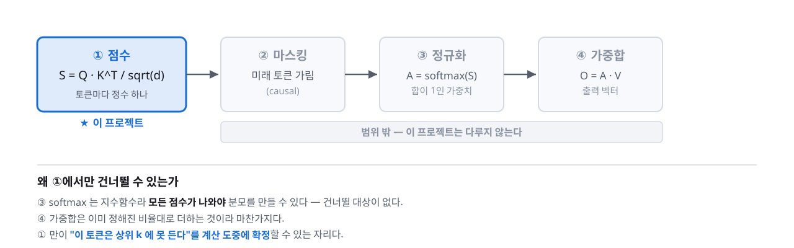
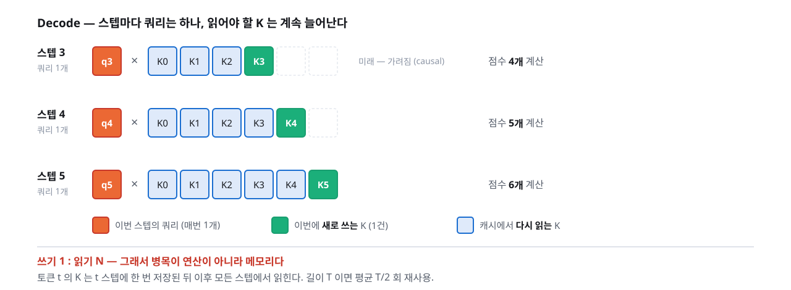
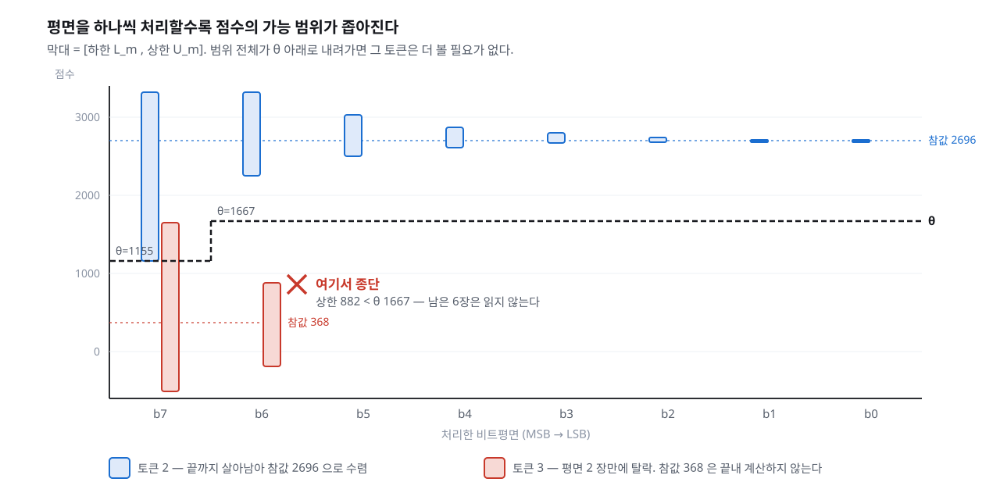

# 수치로 따라가는 어텐션 — 그리고 우리가 가속하는 한 줄

[transformer.md](transformer.md) 가 "왜"를 설명한다면 이 문서는 **"어떻게"를 숫자로** 따라간다.
연필로 검산할 수 있는 크기로 만들었다. 4토큰 · 차원 4.

**여기 나오는 모든 숫자는 실제로 계산해 검증한 값이다.** §5 에 재현 코드가 있다.

> 읽는 순서: [transformer.md](transformer.md) → **이 문서** → [architecture.md §3](../../architecture.md)

---

## 1. 어텐션은 네 단계, 우리는 그중 하나



교과서는 보통 네 단계를 한 덩어리로 설명하지만, **하드웨어 관점에서는 ①만 특별하다.**
③ softmax 는 지수함수라 분모를 만들려면 모든 점수가 나와야 하고, ④ 가중합은 이미 정해진
비율대로 더하는 것이라 건너뛸 대상이 없다. **①만이 "이 토큰은 상위 k 에 못 든다"를
계산 도중에 확정할 수 있는 자리**다.

그래서 이 문서도 ①에 집중한다.

> ⚠ **흔한 오해 — "한 번에 계산한다"**
> 어텐션 자료 대부분은 `softmax(QK^T/√d)V` 를 **행렬 × 행렬**로 설명한다. 문장 전체를
> 한꺼번에 넣는 그림이다. 그건 **Prefill(또는 학습) 이야기다.**
> 우리가 다루는 Decode 는 **쿼리가 하나**뿐이라 **벡터 × 행렬**이다.
> 이 차이가 프로젝트 전체의 전제다([transformer.md §5](transformer.md)).

---

## 2. Decode 에서 실제로 벌어지는 일



스텝마다 **쿼리는 1개**, 비교 대상 K 는 **1개씩 늘어난다.** 미래 토큰은 causal 마스킹으로
가려지므로 스텝 t 에서는 토큰 0..t 까지만 본다.

이 구조가 저장소의 [src/decode_loop.py](../../src/decode_loop.py) 에서 `n_active` 가
스텝마다 자라는 것으로 그대로 구현되어 있다.

**쓰기 1 : 읽기 N.** 토큰 t 의 K 는 t 스텝에 한 번 저장된 뒤 이후 모든 스텝에서 읽힌다.
그래서 병목이 연산이 아니라 메모리 접근이다.

---

## 3. 점수 계산 — 손으로 따라가기

한 디코드 스텝을 잡는다. 활성 토큰 4개, head 차원 4.

### 3-1. 준비

쿼리는 **대칭 signed**, K 는 **비대칭 unsigned** 로 양자화되어 있다
([architecture.md §2](../../architecture.md)).

```
q = [ 5, -3,  7,  2]          ← 이 스텝 내내 고정. 모든 토큰에 공통

      d0   d1   d2   d3
t0 [ 200,  32, 176,  16]
t1 [  96, 224,  48, 128]      ← K (0..255)
t2 [ 232,  16, 208,  64]
t3 [  24, 160,  40, 224]
```

q 에서 **스텝당 한 번만** 뽑아 두는 두 값이 있다. 이게 §4 의 전부를 굴린다.

```
Q+ = 5 + 7 + 2 =  14          (양수의 합)
Q− =        −3 = −3           (음수의 합)
```

### 3-2. 점수

```
s_j = Σ q_i · K[j,i]

s_0 = 5·200 + (−3)·32 + 7·176 + 2·16  = 2168
s_1 = 5·96  + (−3)·224 + 7·48 + 2·128 =  400
s_2 = 5·232 + (−3)·16  + 7·208 + 2·64 = 2696   ← 1등
s_3 = 5·24  + (−3)·160 + 7·40  + 2·224=  368
```

**상위 2개는 {t2, t0}.** 하드웨어의 출력은 이 집합이다.
뒤의 `/√d` 와 softmax 는 범위 밖이고, **순위는 이 정수만으로 확정된다.**

---

## 4. ★ 같은 계산을 MSB-first 로

여기서부터가 교과서에 없는 부분이다. §3-2 를 한 번에 하지 않고 **비트평면 단위로 쪼갠다.**

### 4-1. K 를 비트평면으로

t0 을 예로 들면,

```
200 = 1 1 0 0 1 0 0 0
 32 = 0 0 1 0 0 0 0 0
176 = 1 0 1 1 0 0 0 0
 16 = 0 0 0 1 0 0 0 0
      ↑
      b7 평면 = [1, 0, 1, 0]
```

평면 b 의 부분합은 **곱셈 없이** 구해진다 — 비트가 1인 자리의 q 를 더하기만 하면 된다.

```
P_b7(t0) = 5·1 + (−3)·0 + 7·1 + 2·0 = 5 + 7 = 12
```

네 토큰 전체의 평면별 부분합:

| 평면 | 자리값 | t0 | t1 | t2 | t3 |
|---|---:|---:|---:|---:|---:|
| b7 | 128 | 12 | −1 | 12 | −1 |
| b6 | 64 | 5 | 2 | 14 | 2 |
| b5 | 32 | 4 | 9 | 5 | 6 |
| b4 | 16 | 9 | 7 | 4 | 5 |
| b3 | 8 | 5 | 0 | 5 | 12 |
| b2·b1·b0 | 4·2·1 | 0 | 0 | 0 | 0 |

### 4-2. 상한과 하한

m 장을 처리한 시점에서 남은 자리값의 합은 `2^(8−m) − 1` 이다.
남은 비트가 **전부 1** 이면 최대, **전부 0** 이면 최소 기여가 되므로,

```
R_m = (2^(8−m) − 1) · Q+          ← 남은 평면이 더할 수 있는 최대
L_m = S_m + (2^(8−m) − 1) · Q−    ← 최소

      L_m  ≤  s_j  ≤  S_m + R_m
```

**아직 읽지 않은 비트에 대해 아무 가정도 하지 않는다.** 추정이 아니라 증명이다.

### 4-3. 평면 1장 처리 후

```
S_1 = 128 × [12, −1, 12, −1] = [1536, −128, 1536, −128]
남은 자리값 합 = 2^7 − 1 = 127

L_1 = S_1 + 127·(−3) = [1155, −509, 1155, −509]
U_1 = S_1 + 127·(14) = [3314, 1650, 3314, 1650]
```

θ 는 **활성 토큰 하한 중 2번째로 큰 값** = **1155**.
상한이 1155 아래인 토큰은 아직 없다 → **종단 없음.**

### 4-4. 평면 2장 처리 후 — 여기서 잘린다

```
S_2 = S_1 + 64 × [5, 2, 14, 2] = [1856, 0, 2432, 0]
남은 자리값 합 = 2^6 − 1 = 63

L_2 = S_2 − 189 = [1667, −189, 2243, −189]
U_2 = S_2 + 882 = [2738,  882, 3314,  882]

θ = 1667   (하한 중 2등)
```

**t1 과 t3 의 상한이 882 다. θ 1667 보다 낮다.**

남은 비트를 전부 1로 채워도 1667 을 넘을 수 없다는 뜻이므로,
이 두 토큰은 상위 2개에 **들 수 없음이 확정**된다. **남은 6장은 읽지 않는다.**



### 4-5. 결과

| | |
|---|---|
| 생존 | **{t0, t2}** |
| 참 top-2 | **{t2, t0}** ✔ 일치 — **무손실** |
| 평면 읽기 | 32장 → **20장** (t1·t3 은 2장씩만) |
| 절감 | **37.5%** |

t1 의 참값이 400 이고 t3 이 368 이라는 것은 **끝내 계산하지 않는다.** 알 필요가 없기 때문이다.

> ⚠ 위 절감은 **이론값**이다. 실제 BRAM 은 워드 단위로 읽으므로 흩어진 종단은
> 그대로 절감이 되지 않는다. [architecture.md §3-6](../../architecture.md) 과
> `decision_latency_planes` 참조.

---

## 5. 직접 확인하기

```python
import numpy as np

q = np.array([5, -3, 7, 2])
K = np.array([[200, 32, 176, 16], [96, 224, 48, 128],
              [232, 16, 208, 64], [24, 160, 40, 224]])

s = K @ q                                   # [2168 400 2696 368]
Qp, Qm = q[q > 0].sum(), q[q < 0].sum()     # 14, -3

planes = (K[None] >> np.arange(7, -1, -1)[:, None, None]) & 1
P = (planes * q).sum(axis=2)                # (8, 4) 평면별 부분합

S = np.zeros(4, dtype=int)
for m in range(1, 9):
    S += (1 << (8 - m)) * P[m - 1]
    rem = (1 << (8 - m)) - 1
    L, U = S + rem * Qm, S + rem * Qp
    assert (L <= s).all() and (s <= U).all()        # ★ 구간은 항상 참값을 품는다
    print(f"m={m}  L={L}  U={U}")
```

마지막 `assert` 가 이 프로젝트의 핵심 불변식이다.
저장소에서는 [tests/test_bounds.py](../../tests/test_bounds.py) 가 같은 것을
모든 평면·모든 토큰에 대해 강제한다.

---

## 6. 여기서 이어지는 질문들

이 예제는 **정답 판정이 어떻게 무손실일 수 있는지**만 보였다. 실제 설계는 여기서 세 가지가 더 붙는다.

| 질문 | 어디에 |
|---|---|
| θ 를 **언제** 확정할 것인가 (여기서는 매 평면 갱신) | [architecture.md §3-5](../../architecture.md) |
| 종단이 흩어지면 메모리 절감이 실현되는가 | [architecture.md §3-6](../../architecture.md) |
| 일부러 손실을 감수하면 얼마나 더 아끼는가 (margin) | [architecture.md §3-7](../../architecture.md) |

---

## 7. 출처

이 문서의 구성은 사내 교육자료 *Lecture 3 — 자연어 처리* 의 Self-Attention 절에서
착안했으나, **수치 예제·그림·설명은 전부 이 프로젝트를 위해 새로 만든 것이다.**
원자료는 encoder-decoder 번역 모델과 학습 과정 기준이라 Decode·KV 캐시·GQA·양자화를
다루지 않으므로, 그대로 두면 §1 의 "한 번에 계산한다" 오해로 이어진다.
